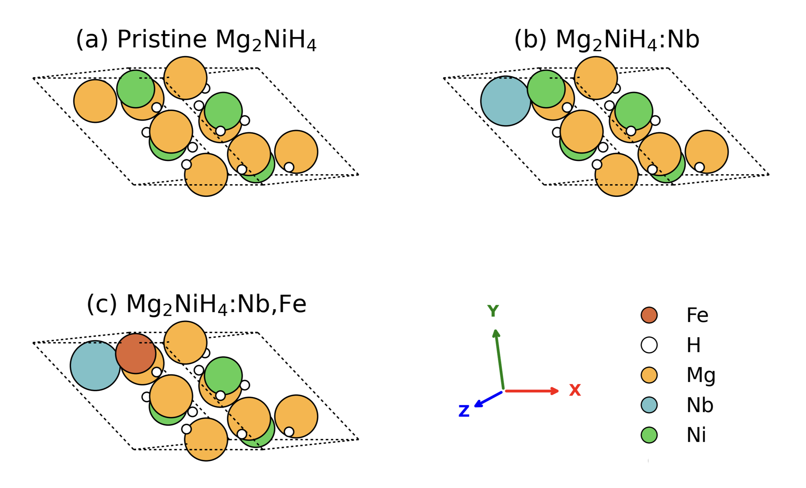

# hEspesso — DFT studies of Mg-based hydrogen-storage catalysts

Quantum ESPRESSO (PBE + DFT-D3) workflows that test whether transition-metal
and oxide additives **destabilise** Mg-based hydrides — i.e. raise ΔH per H₂
toward zero so that H₂ release becomes easier under practical conditions.

More material systems will be added over time.

*Supercells studied in the Mg₂NiH₄ branch: (a) pristine, (b) Nb-substituted,
(c) Nb,Fe co-substituted. One Mg site at the cell edge is replaced by Nb
(blue) and the neighbouring Mg by Fe (red-brown).*

## Sub-studies

| Directory | Question |
|-----------|----------|
| [`mg-nico/`](mg-nico/README.md) | Do Ni and Co substitutional dopants in MgH₂ lower ΔH per H₂? Baseline + 12.5% TM dopant at fixed 2×2×2 supercell topology. |
| [`mg2ni-nb2o5fe/`](mg2ni-nb2o5fe/README.md) | Do Nb (from Nb₂O₅) and Fe additives destabilise Mg₂NiH₄? Pristine vs. Nb-doped vs. Nb,Fe co-doped. |
| [`pseudo/`](pseudo/) | Shared UPF pseudopotential library used by all studies. |

Each sub-study is self-contained — see its README for reactions, settings, and reproduction steps.
